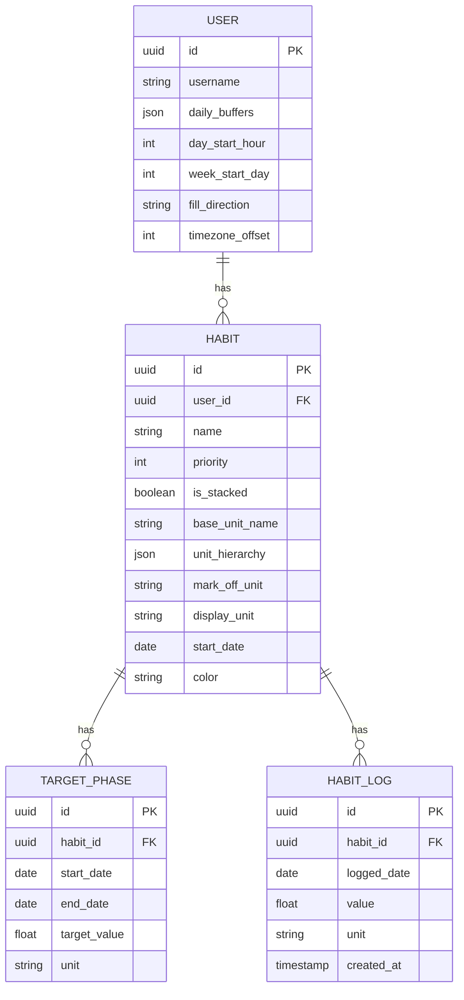

# Habit Bank - System Architecture

This document details the technical implementation, data structures, and algorithms that power the Habit Bank ledger engine.

## 1. Data Model (SQLModel)

The system uses `SQLModel` (FastAPI + SQLAlchemy + Pydantic) to ensure a unified data layer across persistence and API responses.

### 1.1 Core Entities

- **USER**: Individual nodes in the temporal network. 
    - `daily_buffers`: JSON of named time deductions (e.g., {'Sleep': 28800}).
    - `day_start_hour`: Hour (0-23) when the user's logical day begins.
    - `week_start_day`: Day (0-6, 0=Monday) when the week begins.
    - `fill_direction`: Deficit filling strategy ('start_date' or 'today').
    - `timezone_offset`: Minutes from UTC.
- **HABIT**: The identity protocol. 
    - `is_stacked`: Boolean toggle for debt/buffer accumulation.
    - `unit_hierarchy`: Recursive conversion map (JSON).
    - `mark_off_unit`: Unit used for user input logging.
    - `display_unit`: Unit preferred for UI visualization.
- **TARGET_PHASE**: Chronological goal intervals. `TargetPhase` changes allow for historical mapping (e.g., moving from 10/day to 20/day).
- **HABIT_LOG**: Records of physical effort. Stored with the original `unit` used by the user, then resolved to base units at runtime.

### 1.2 Schema Overview

---

## 2. Core Engines

### 2.1 Recursive Unit Converter
The `UnitConverter` resolves any custom metric down to the "Universal Currency" (seconds) using a recursive path-finding algorithm.

#### Ambiguity Detection
The converter rejects hierarchies where a unit has multiple conflicting paths to time.
- **Valid:** `1 Page = 10 Lines`, `1 Line = 6s`, `1 Page = 60s` (Both paths resolve to 60s).
- **Invalid:** `1 Page = 10 Lines`, `1 Line = 6s`, `1 Page = 100s` (Rejected because 60s != 100s).

#### Base Time Mappings
The system includes standard time mappings (`sec`, `min`, `hour`, `day`, `week`, `month`, `year`) and their second equivalents.

### 2.2 Chronological Waterfall Simulation (O(N))
The `LedgerEngine` processes the timeline sequentially from `start_date` to `today` in `O(N)` time.

#### Waterfall Logic Steps
1.  **Initialize**: Generate a continuous array of `TimelineDay` objects.
2.  **Fill Order**:
    - **Step A: Fill Today**: Logged effort satisfies the target for the current day first.
    - **Step B: Fill Past Debt**: If `is_stacked` is true, surplus is applied to unfilled past days.
        - `fill_direction="start_date"`: Repays oldest debts first.
        - `fill_direction="today"`: Repays most recent debts first.
    - **Step C: Bank Future Buffer**: Any remaining surplus is stored as a `future_buffer` if `is_stacked` is true.

#### Temporal Integrity
- **Logical Date**: Calculated as `UTC + Offset - DayStartHour`. All logs are anchored to this logical date rather than absolute UTC.
- **Immutability**: Log mutations (create/delete) are restricted to the current logical date.

### 2.3 Forecast & Analytics Logic
- **Debt Velocity**: A moving average calculation (7-day with lifetime fallback).
- **Time to Zero**: Forecasted clearance date based on surplus velocity.
- **Temporal Affinity**: A frequency map of normalized log timestamps identifying the "mode hour" for successful completion.

---

## 3. Frontend Architecture (Next.js 15)

### 3.1 Industrial Pro Design System
The UI focus on high performance and density.
- **Framer Motion**: Used for layout transitions and smooth feedback.
- **Responsive Drawer Sidebar**: Adapts to any screen resolution.

### 3.2 Key Components
- **DailySpectrumWidget**: 24h cycle visualization integrated with logical date boundaries.
- **HabitCard / HabitRegistryCard**: Advanced cards supporting in-line unit switching and historical intensity maps.
- **Wizard**: Multi-step initialization for complex unit hierarchies.

---

## 4. Engineering Standards

- **Precision**: Internal calculations use `float` to maintain sub-second accuracy across multi-level conversions.
- **Traceability**: All critical engine functions are decorated with `@deeplog` for high-fidelity execution tracing.
- **O(N) Amortized Time**: Simulation performance is strictly monitored to handle 10+ years of history under 5ms.
